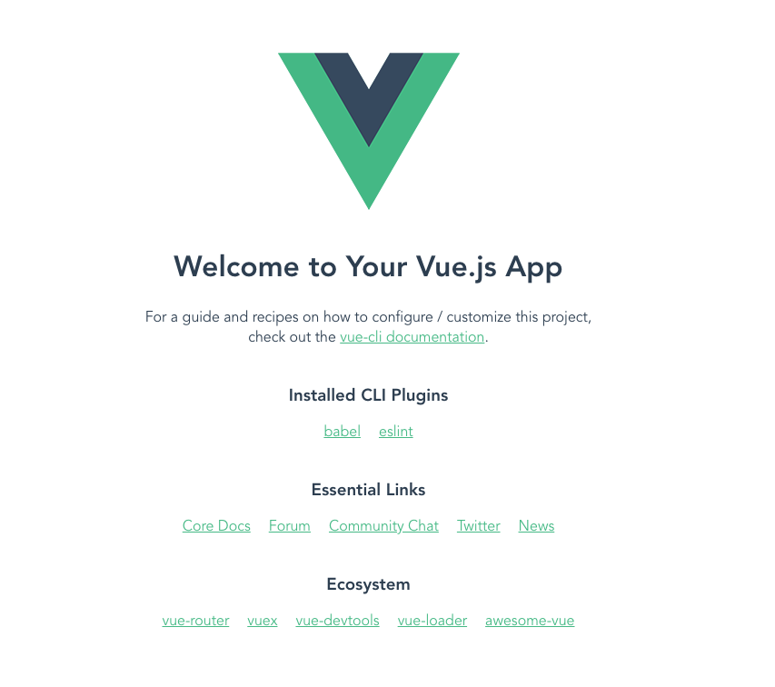
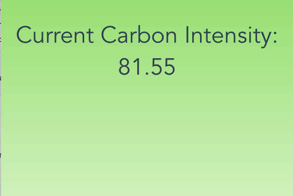
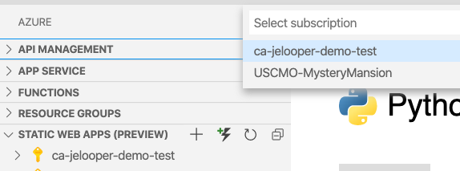

# Workshop Instructions

In this workshop, we will discuss how to create an Azure Static Web app to query the Carbon API using an Azure Function. We'll build a static web app from scratch to query this API.

| **Project Goal**              | Create a basic Vue.js app and API to query the co2signal API to find your region's carbon usage and change the screen color accordingly.                                                                                                                                                                                                                                                                                                                           |
| ----------------------------- | ------------------------------------------------------------------------------------------------------------------------------------------------------------------------------------------------------------------------------------------------------------------------------------------------------------------------------------------------------------------------------------------------------------------------------------------------------------------ |
| **What will you learn**       | Configure a basic web application in Vue.js, build an API to query an external API, and deploy this site on Azure Static Web Apps.                                                                                                                                                                                                                                                                                                                                 |
| **What you'll need**          | [Visual Studio Code](https://code.visualstudio.com/Download) with the [Azure Static Web Apps](https://marketplace.visualstudio.com/items?itemName=ms-azuretools.vscode-azurestaticwebapps) installation. An API key from the [Carbon API](https://www.co2signal.com/). [Azure Extension for Visual Studio Code](https://marketplace.visualstudio.com/items?itemName=ms-vscode.vscode-node-azure-pack). The [Vue.js CLI](https://cli.vuejs.org/) installed locally. [Npm](https://www.npmjs.com/) installed locally |
| **Duration**                  | 1 hour                                                                                                                                                                                                                                                                                                                                                                                                                                                             |
| **Just want to try the app?** | [click here](https://happy-ground-0f458bb0f.azurestaticapps.net/#/?region=US-NEISO)                                                                                                                                                                                                                                                                                                                                                                                |

## Pre-Learning

Learn how to build a Vue.js app on [Microsoft Learn](https://docs.microsoft.com/learn/modules/create-web-app-with-refreshable-models/?WT.mc_id=green-github-jelooper).

## Architecture

First, create a folder to house your app and api folders. Using the Vue CLI, installed locally on your machine, create a web app using the command line. `Cd` to the area you want on your local machine, and type `vue create app`. A wizard starts: use the default preset (babel, eslint). A folder with that name will be created. You should have a folder structure like this:

my-green-app    
└───app

Cd to your app folder and use npm to install `axios` and `vue-router` to your app so that you can query an API and use query parameters in your url: `npm add vue-router axios`. Your package.json file in the root of your app should now include these dependencies:

```javascript
"dependencies": {
    "axios": "^0.19.2",
    "core-js": "^3.6.5",
    "vue": "^2.6.11",
    "vue-router": "^3.3.4"
  },

```
Typing `npm run serve` will open your app on your localhost. So far, it's just a plain Vue.js app.



## Build the web app interface

Now, you can start building the interface for your carbon trigger app. Working in [`/src/main.js`](./samples/web-app/app/src/main.js), import the vue-router by overwriting that file with this code:

```
import Vue from 'vue';
import App from './App.vue';
import VueRouter from 'vue-router';

const router = new VueRouter({});
Vue.config.productionTip = false;
Vue.use(VueRouter);

new Vue({
	router,
	render: (h) => h(App),
}).$mount('#app');
```
Although this app only has one page, you're going to use the router to read query parameters from the url, later on.

Next, replace the `<template>` block at the top of [`/src/App.vue`](./samples/web-app/app/src/App.vue) with the following markup: 

```
<template>
  <div id="app" :style="background">
    <div v-if="loading" class="emoji-container">
      <p role="img" class="blowing-leaf" aria-label="Blowing leaf Emoji">🍃</p>
    </div>
    <h1 v-else>Current Carbon Intensity: {{ carbonIntensity }}</h1>
  </div>
</template>
```
In this block, you will show a loading animation (it's a spinning leaf) until the API has had time to return data about your region's carbon usage. The `style` of the app is also a variable, and you'll change the background gradient of the app based on the API's results.

> An error will probably be thrown here - you'll clear it in a moment

## Build the web app logic

Now you're going to edit the `<script>` block in [`/src/App.vue`](./samples/web-app/app/src/App.vue). To clear the error that's thrown, delete the import of HelloWorld as you're not going to use it (it's the line under the `<script>` tag. Also delete these lines, as you don't need to use this component:

```
components: {
    HelloWorld
  }
```

Now you need to import axios and add a data method, that always returns data to the front-end application. Under the line, `name: 'App'` add a data method:

```
import axios from "axios";

data() {
    return {
      response: {},
      carbonIntensity: "",
      background: "",
      loading: false,
      region: ""
    };
  },
```

These values act as placeholders for the data that flows around the app.

Next, add a lifecycle hook called 'created()' after the closing comma of the data() method. This lifecycle hook will fire when the app loads:

```
async created() {
    this.loading = true;
    this.region = this.$route.query.region || "FR";
    try {
      const response = await axios.get(
        "/api/getCarbonUsage?region=" + this.region + ""
      );
      this.response = response.data;
      if (this.response !== null) {
        this.loading = false;
      }
      this.carbonIntensity = response.data.carbonIntensity.toFixed(2);
      if (this.carbonIntensity <= 100) {
        //green
        this.background =
          "background: rgb(255,255,255); background: linear-gradient(0deg, rgba(255,255,255,1) 0%, rgba(151,222,107,1) 100%);";
      } else if (this.carbonIntensity <= 200) {
        //yellow
        this.background =
          "background: rgb(255,255,255); background: linear-gradient(0deg, rgba(255,255,255,1) 0%, rgba(236,214,98,1) 100%);";
      } else if (this.carbonIntensity <= 300) {
        //orange
        this.background =
          "background: rgb(255,255,255); background: linear-gradient(0deg, rgba(255,255,255,1) 0%, rgba(242,145,65,1) 100%);";
      } else if (this.carbonIntensity > 300) {
        //red
        this.background =
          "background: rgb(255,255,255); background: linear-gradient(0deg, rgba(255,255,255,1) 0%, rgba(242,85,65,1) 100%);";
      }
    } catch (error) {
      console.error(error);
    }
  }
```

What's going on here? 

First, we set the variable 'loading' to true so that the spinner starts. Then we get a region from the app's url query string, if it exists. Then we set up a `try/catch` routine, to get a response from an API call. After that, we manipulate the data returned to set the url background gradient to change color depending on the value of the carbon intensity (more intense = more red).

If you run the app, however, you note that nothing happens, as you haven't yet built the API. You'll do that shortly.

## Style the app

Overwrite the `<style>` block entirely with the following styles to set up gradients and a spinner animation:

```
<style>
#app {
  font-family: Avenir, Helvetica, Arial, sans-serif;
  -webkit-font-smoothing: antialiased;
  -moz-osx-font-smoothing: grayscale;
  text-align: center;
  color: #2c3e50;
}

html,
body,
div,
h1 {
  margin: 0;
  padding: 0;
  border: 0;
  font-size: 100%;
  font: inherit;
  vertical-align: baseline;
  width: 100%;
  height: 100%;
}
h1 {
  padding-top: 40px;
  font-size: 3em;
}

/*https://codepen.io/stevenmacdougall/pen/ZEboRXo*/
p {
  font-size: 50px;
}

.emoji-container {
  height: 100px;
  width: 100px;
  display: inline-block;
}

/* Blowing leaf animation */
.emoji-container .blowing-leaf {
  -webkit-animation-name: blowing-leaf-animation;
  animation-name: blowing-leaf-animation;
  -webkit-animation-duration: 0.7s;
  animation-duration: 0.7s;
  -webkit-animation-iteration-count: infinite;
  animation-iteration-count: infinite;
  display: inline-block;
}
@-webkit-keyframes blowing-leaf-animation {
  0% {
    -webkit-transform: translate(0px, 0px) rotate(0deg);
    transform: translate(0px, 0px) rotate(0deg);
  }
  50% {
    -webkit-transform: translate(30px, 10px) rotate(180deg);
    transform: translate(30px, 10px) rotate(180deg);
  }
  100% {
    -webkit-transform: translate(0px, 0px) rotate(360deg);
    transform: translate(0px, 0px) rotate(360deg);
  }
}

@keyframes blowing-leaf-animation {
  0% {
    -webkit-transform: translate(0px, 0px) rotate(0deg);
    transform: translate(0px, 0px) rotate(0deg);
  }
  50% {
    -webkit-transform: translate(30px, 10px) rotate(180deg);
    transform: translate(30px, 10px) rotate(180deg);
  }
  100% {
    -webkit-transform: translate(0px, 0px) rotate(360deg);
    transform: translate(0px, 0px) rotate(360deg);
  }
}
</style>

```
Still, not much is going on in this app. Let's build the API.

## Build the API

Switching to your `api` folder, you now can start building an API using Azure Functions. Azure Static Web apps allow you to do this very easily. They even handle CORS cleanly!

Cd to your `api` folder and use your Azure tools to create a function app in the empty folder. Click on the Azure tooling icon in the left navigation of VS Code and click the arrow icon to 'create a function'. Create a new project in your folder.


Create a JavaScript function using the HttpTrigger preset. Call this function `getCarbonUsage` and set it to 'anonymous' so your app can call it. The function is created and an index.js file opens.

Overwrite this file:

```
module.exports = async function (context, req) {
	const axios = require('axios');
	const region = req.query.region || (req.body && req.body.region);
	console.log(region);

	var config = {
		method: 'get',
		url: 'https://api.co2signal.com/v1/latest?countryCode=' + region + '',
		headers: {
			//use your own token please
			'auth-token': 'xxxx',
		},
	};

	try {
		const { data } = await axios(config);
		context.log(data);
		context.res = { body: data.data };
		// do something with the data
		return data;
	} catch (err) {
		context.log(err);
		context.res = { body: data };
		// do something with the error
	}
};
```
>At this point, to test this function, you'll need your own API key. Get one quickly from the [Carbon API](https://www.co2signal.com/) via email and replace `xxxx` with your auth-token.

Since you use axios to query the co2signal API, make sure to add it to your function's package.json file:

```
"dependencies": {
    "axios": "0.19.2"
  },
```
  
Type 'npm i' to install axios, and then you're ready to test the API.

Now you can test your API call by clicking the 'debug' arrow in the left navigation of VS Code, then the 'attach to node function' arrow at the top. You'll see the function start to run and a URL produced. You can test it locally here: `http://localhost:7071/api/getCarbonUsage?region=US-NEISO` - don't forget to add a region code to the end, as the function expects it to come via a query string.

If all is well, you'll see some JSON returned for your region: 

```
{
  "carbonIntensity": 339.23091352498733,
  "fossilFuelPercentage": 66.322926967085749
}
```

Now you're ready to configure your app to use the API.

## Query the API

In a Vue app, there's one more file you need to add to test the API locally. Add a `vue.config.js` file at app root.

In that file, add this code:

```
module.exports = {
	configureWebpack: {
		devtool: 'source-map',
	},
	devServer: {
		proxy: {
			'/api': {
				target: 'http://localhost:7071',
				ws: true,
				changeOrigin: true,
			},
		},
	},
};

```
Now the app is configured to proxy an api route on a development server. 

You should now be able to use your new API locally. Assuming your API is still running on port 7071, restart your web app and take a look at the way it reacts to the API call:



Try changing the region in the query string like this: http://localhost:8080/#/?region=US-NEISO - does the interface change?


## Deploy the app

At this point, you can deploy your app to a static web app hosted on Azure. The easiest way to do this is to use the Azure Static Web App tools for VS Code. They are located in the Azure tooling:



Follow the tooling to give the app a name and deploy it to Azure. A new folder will be created called `.github/workflows` containing a .yaml file. In this file, the deployment of the web app is controled via a CI/CD process. Be sure to edit these lines to suit your new app:

```
app_location: "app" # App source code path
api_location: "api" # Api source code path - optional
app_artifact_location: "dist" # Built app content directory - optional
```          
This way, the build process, managed by GitHub Actions, will kick off whenever you make changes to the files, and both your function and your app will be built and deployed. You can test your new app on the url that you're given by the process, something like [`https://happy-ground-0f458bb0f.azurestaticapps.net`](https://happy-ground-0f458bb0f.azurestaticapps.net).

At this point, you have built a nice static web app using Vue with a built-in Azure function that queries an API to get your region's carbon usage. What else can you build with this API? What other green applications would be fun to build?


## Next steps

If you want to continue learning about Azure Static Web Apps, please visit the [Microsoft Learn](https://docs.microsoft.com/en-us/learn/modules/publish-app-service-static-web-app-api/?WT.mc_id=green-github-jelooper) module on the topic for more information.


<!--## Path to certification (AZ 900?)

## Feedback: Qualtrics?-->

[Code of Conduct](CODE_OF_CONDUCT.md)

[Contributing Guide](CONTRIBUTING.md)
